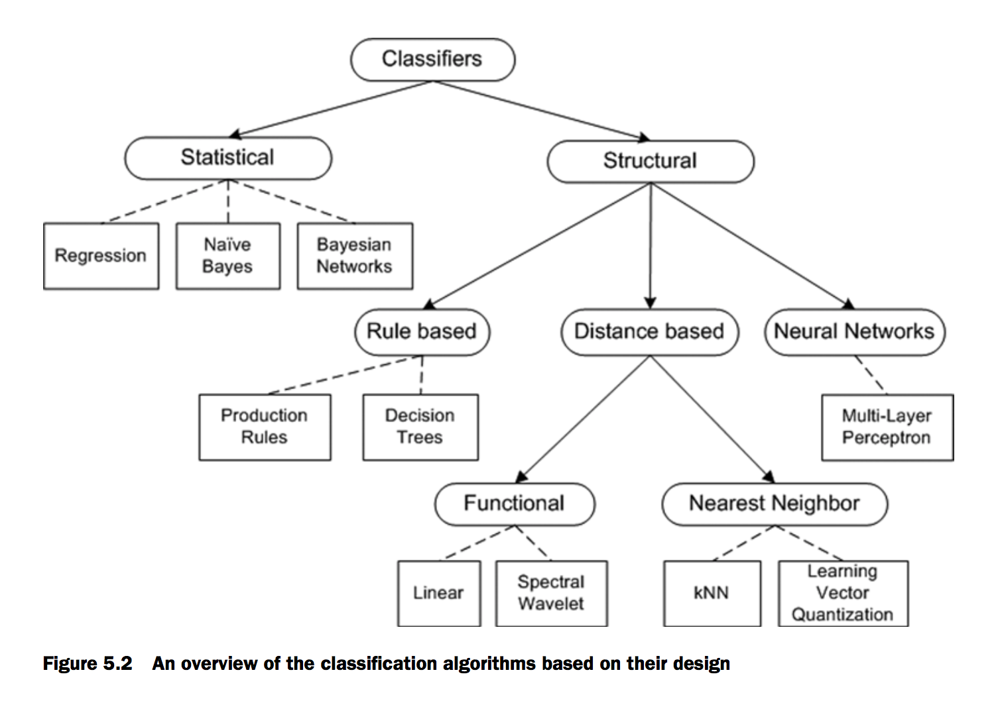

# Manning.Algorithms.of.the.Intelligent.Web

notations:

    !         - important
    ?         - todo
    #         - segment

## chapter 5: Classification: placing things where they belong
### ! 5.2 An overview of classifiers

#### 5.2.1 Structural classification algorithms

* Rule base: production rules(if-then clauses) & decision tree:  
    simle yet effective, not able to deal unseen data.

* distance-based algorithms: 
    >careful normalization and analysis of the attribute space is crucial to the success of distance-based algorithms.

    * Functional classifiers:  approximate the data by function, as the name suggests
        * linear regression & linear approximation
    * Nearest-neighbor algorithms attempt to find the nearest class for each data point. (using distance )

* Neural network (deep learning):
    > we don’t have a design methodology that would be applicable in a large number of problems

    这个问题 TensorFlow应该是解决掉了
    > , and it’s difficult to interpret the results of neural network classification

    这个应该会持续存在

#### 5.2.2 Statistical classification algorithms

* Regression algorithms: are usually employed when the data points are inherently numerical variables
    * logistic regression.

* Bayes rule or Bayes theorem:
    > The fascinating aspect of Bayesian algorithms is that they seem to work well even 
    when that independence assumption is clearly violated

#### 5.2.3 The lifecycle of a classifier
>There are three stages in the life- cycle of a classifier: training, testing, and production.

? using what metrics during validation phase to tell if the trained model is good enough 

Links:
* [Naive Bayes classifier](https://en.wikipedia.org/wiki/Naive_Bayes_classifier)
    * [Chain rule (probability)](https://en.wikipedia.org/wiki/Chain_rule_(probability))
        * [Joint probability distribution](https://en.wikipedia.org/wiki/Joint_probability_distribution)
    * [! Bayes' theorem](https://en.wikipedia.org/wiki/Bayes%27_theorem)
        贝叶斯定律是用来根据已知的观察获得的概率事件的独立发生的概率p(a), 和事件相关的的参数发生的概率p(b|a), 和相关参数
        独立发生的概率p(b)来预测已知相关参数事件发生的概率p(a|b)。
        * [贝叶斯推断及其互联网应用（一）：定理简介](http://www.ruanyifeng.com/blog/2011/08/bayesian_inference_part_one.html)
        * [贝叶斯推断及其互联网应用（二）：过滤垃圾邮件](http://www.ruanyifeng.com/blog/2011/08/bayesian_inference_part_two.html)
        * [贝叶斯推断及其互联网应用（三）：拼写检查](http://www.ruanyifeng.com/blog/2012/10/spelling_corrector.html)

    * [? Bayesian inference](https://en.wikipedia.org/wiki/Bayesian_inference): failed to understand it.
        > Bayesian inference is a method of statistical inference in which Bayes' theorem is used to update the probability for a hypothesis as more evidence or information becomes available. 

# Links
* [! Machine Learning: Measuring Similarity and Distance](https://dzone.com/articles/machine-learning-measuring)

* [List_of_mathematical_symbols](https://en.wikipedia.org/wiki/List_of_mathematical_symbols)
* [? Integral(积分)](https://en.wikipedia.org/wiki/Integral)
* [? Derivative](https://en.wikipedia.org/wiki/Derivative)
* [? Antiderivative](https://en.wikipedia.org/wiki/Antiderivative)
* [Maximum likelihood estimation(MLE)](https://en.wikipedia.org/wiki/Maximum_likelihood_estimation)
    * [! Likelihood function](https://en.wikipedia.org/wiki/Likelihood_function)
        Likelihood function: 是求 MLE 的关键。而 #Log-likelihood 是Likelihood function的一个非常典型的例子
        这连接的一节介绍了Log-Likelihood的好处:easy to compute with. make complex computation simple.
        注意#Log-likelihood下面的example的数学标注, 包括MLE的标注

        * [arg max](https://en.wikipedia.org/wiki/Arg_max)
            > In contrast to global maxima, referring to the largest outputs of a function, 
            arg max refers to the inputs, or arguments, at which the function outputs are as 
            large as possible.

            argmax: 函数达到最大值(in its domain), 的时候的argument的值  
            global: 函数达到最大值的值

            see #"Symbols based on Latin letters" under Link ^"List_of_mathematical_symbols" 
            for notation explaination.

            * [Domain of a function](https://en.wikipedia.org/wiki/Domain_of_a_function)
            >In mathematics, and more specifically in naive set theory, the domain of definition 
            (or simply the domain) of a function is the set of "input" or argument values for 
            which the function is defined.

        * [Derivative](https://en.wikipedia.org/wiki/Derivative): 用于求方程的极值。妈蛋，大学叫你不好好学习。

        * [Probability density function(PDF)](https://en.wikipedia.org/wiki/Probability_density_function)
            PDF 的domain上的积分等于1(概率总和)

    * [Independent and identically distributed random variables](https://en.wikipedia.org/wiki/Independent_and_identically_distributed_random_variables)
        > In probability theory and statistics, a sequence or other collection of random variables is 
        independent and identically distributed (i.i.d.) if each random variable has the same probability 
        distribution as the others and all are mutually independent.

# todos:

    done:

    pending:

        linear regression & linear approximation & logistic regression.