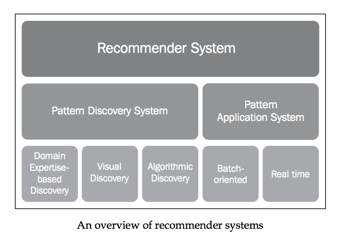
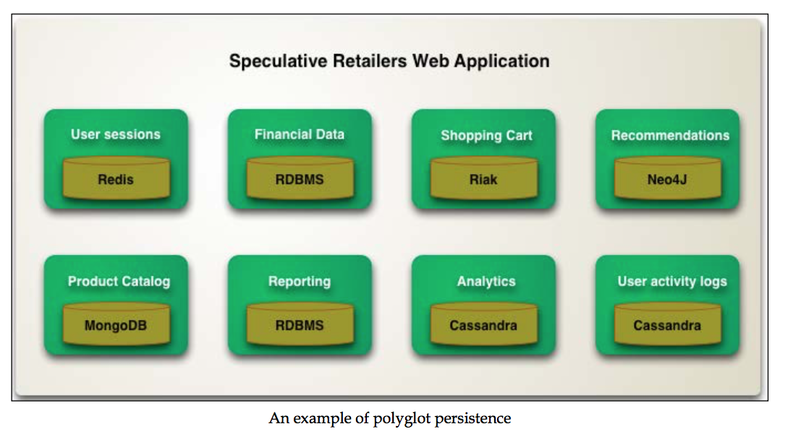

# Learning Neo4J
这是我读过的第一本graph database的书，这本书也确实讲解了些有趣的知识点。比如，如何用neo4j
来分析:
* 社交网络
* 金融欺诈
* 公司的应急反应和影响
* 商品推荐
* etc...

速看: 2整天...

## chapter 2: Graph Databases - Overview

亚马逊购物车的实现 - Key-Value stores:
>Key-Value stores are probably the simplest type of task-oriented NOSQL databases. The data model of the original task at hand was probably not very complicated: Key- Value stores are mostly based on a whitepaper published by Amazon at the biennial ACM Symposium on Operating Systems Principles, called the Dynamo paper.
The data model discussed in that paper is that of Amazon's shopping cart system, which was required to be always available and support extreme loads. Therefore, the underlying data model of the Key-Value store family of database management systems is indeed very simple: keys and values are aligned in an inherently schema- less data model. And indeed, scalability is typically extremely high, with clustered systems of thousands of commodity hardware machines existing at several high-end implementations such as Amazon and many others. Examples of Key-Value stores include the mentioned DynamoDB, Riak, Project Voldemort, Redis, and the newer Aerospike. 

Column-Family stores - Google Big Table: 这个需要以后看下，究竟是什么

Graph Databases:
>They always have a start and an endpoint, therefore have a direction. They cannot be dangling, but can be self-referencing (same node as start- and endpoint)

Why use a graph database?
* Complex queries:
  * Complex queries are the types of questions that you want to ask of your data that
  are inherently composed of a number of complex join-style operations. These operations, as every database administrator knows, are very expensive operations
  in relational database systems, because we need to be computing the Cartesian product of the indices of the tables that we are trying to join. 

* Path finding queries:
  * The problem with such queries in other database management systems is that you would actually have to understand the structure of the potential paths extremely well. You would have to be able to tell the database how to "jump" from table to table, so to speak. In a graph database, you can still do that, but typically you won't. You just tell the database to apply a graph algorithm to a starting point and an endpoint and be done with it. It's up to the database to  gure out if and how these data elements would be connected to each other and return the result as a path expression for you to use in your system. The fact that you are able to delegate this to the database is extremely useful, and often leads to unexpected and valuable insights.

Why not use a graph database, and what to use instead?
* Large, set-oriented queries
* Graph global operations
  * While graph databases are extremely powerful at answering "graph local" questions, there is an entire category of graph tools (often referred to as graph processing engines or graph compute engines) that look at the graph global problems.

* Simple, aggregate-oriented queries

## chapter 3: Getting Started with Neo4j

Neo4j prides itself in being an ACID-compliant database:

* Atomicity: This means that changes in the database must follow an all
or nothing rule. Transactions are said to be "atomic" if one part of the transaction fails, then the consequence would be that the entire transaction is rolled back.
* Consistency: This means that only consistent or "valid" data will be allowed to be entered into the database. In relational terminology, this often means that the schema of the database has to be applied and maintained at all times. The main consistency requirement in Neo4j is actually that the graph relationships must have a start and an end node.
* Isolation: This requires that multiple transactions that are executed in parallel on the same database instance would not impact each other
* Durability: This basically means that committed transactions cannot just disappear and be lost.

Complex Join OPs:

>Graph database management systems do not suffer from these problems. The join operations are effectively precalculated and explicitly persisted in the database based on the relationships that connect nodes together. Therefore, joining data becomes as simple as hopping from one node to another—effectively as simple as following a pointer. These complex questions that are so dif cult to ask in a relational world
are extremely simple, ef cient, and fast in a graph structure.

Path finding queries:

* See whether the path actually exists. Are there any connections between two data elements, and if so what does that connectivity look like?
* Look for the optimal path. Which path between two things has the lowest "cost?"
* Look for the variability of the path if a certain component of the path changes. What happens to the path if the properties of a node or relationship change?

Graph dababase building bricks:

* Nodes: These are typically used to store entity information. 
* Relationships: These are used to connect nodes to one another explicitly and therefore provide a means of structuring your entities.
* Properties: Both nodes and relationships are containers for properties, which are effectively name/value pairs. 
* Labels: what node type it is

## chapter 4: Modeling Data for Neo4j

Graph modeling best practices:
* Design for query-ability
* Align relationships with use cases
* Look for n-ary relationships
* Granulate nodes
* Use in-graph indexes when appropriate

Pitfall:
> A very interesting problem then occurs in datasets where some parts of the graph are all connected to the same node. This node, also referred to as a dense node or a supernode, becomes a real problem for graph traversals because the graph database management system will have to evaluate all of the connected relationships to that node in order to determine what the next step will be in the graph traversal. Supernodes can be a real issue in graph database models and should be avoided when setting up your Neo4j instances.

## chapter 6: Use Case Example – Recommendations

### Recommender systems dissected:

Usage cases:
* Specific query examples for recommendations
* Fraud detection systems
  * The principle of this fraud detection system, however, would be very similar to that of a retail recommender system: define a pattern, detect a pattern, and act on the occurrence of that pattern with some kind of business-related measure.

* Access control systems - 这个应用是判断对应的用户或者组有没有对应的权限，如果能有路径联通目标和实体，那么就有权限。否则没有。
* Social networking systems

## chapter 9: Other Tools Related to Neo4j
Data integration tools - 将不同类型的databases整合起来的工具

