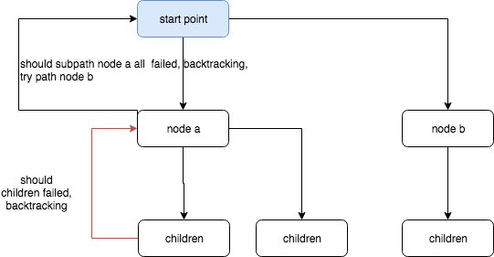

# Classic Computer Science Problems in Python


## chapter 02: Search problems

* `A* search`, 这个方法就是用一个`cost function-g(t)`, `heuristic function-f(t)` 加一个priority queue来做的, 通过priority queue 弹出最小的 `f(t)`, 来计算最后的的值.


## chapter 03: Constraint-satisfaction problems
这章我理解下来看, CSP 在这章的解法, 就是用暴力尝试所有的可能性, 找出第一个满足条件的解. 就代码上来看, 我还是比较佩服作者定义的CSP problem的framework代码, 竟然这么通用.


### backtracking: 
> `Backtracking` is the idea that once you hit a wall in your search, you go back to the last known point where you made a decision before the wall, and choose a different path.

相当于深度优先的搜索一样, 只不过在做深度优先的遍历的时候, 你回去不停判断当前所有条件是否满足, 满足就返回结果, 并停止遍历. 




### CSP problem framework
作者将 CSP 分解为3个关键

* variable: 变量, 
* Domain: 可以被变量设置的值的可能性集合
* Constraint: 为达到解, 所有变量必须满足的条件.
* search function: 搜索解的关键函数, 此章为 backtracking function.

核心的backtrack的伪代码逻辑, 这个地方是寻找解的关键函数
```
fn backtrack:
    check if the answer if found?
        if is found?
            return with Some(A)
    for all unset variables, initialily this is [],
        # make an assignment to this variable,  
        check all the constraints are meet?
            if so:
                continue backtrack fn recursively call.
            else: 
                return with None
    return with None
```

## chapter 04: Graph problems

