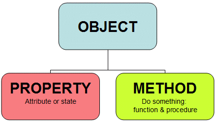
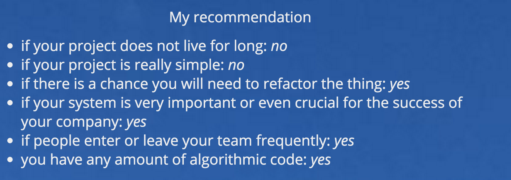

# Title: General introduction to Programming language ?

# why the heck is this written in english:
*lazy guy*, hate to type, hate to translate things in my head 

# Outlines:
  * why learn new language
  * general language introduction
  * typescript


#  why learning another language:

>to be a better progammer

* things are connected  
  Rx = functional combinators + nodejs stream  
  typescript can help with you enter into a strong type language(if u havent played a static typed language before)
* help you think differently, each language has some kind programming paradiam
  OOP, functional, Procedure, Meta(write program to generate program )...etc
* battery included features
    * Immutable Objects
    * builted-in full fledged collections
    * elegant ways to handling errors
* different language excel at different application domain

      python:               data mining & machine learning & system administration & devops & almost everything
      scala:                big data, java alternative
      java, golang:         backend
      c:                    embeded systems
      js:                   front end.
      nodejs:               IoT & backend
      swift & object c:     ios related
      R:                    data sci

* abstract your code in more elegant ways
* reads lots of books
* compile to JS

## Overview language & Programming Paradiam


#### Programming Paradiam
> almost every other language can do some multi paradiam programming, but some language just feel more natrual & easy

* OOP:

  java, c++
* Procedure:

    c
* Functional:

    Haskell

* multi Paradiam:

    swift, scala, python, ....

* others ...: i duno

#### Language Birdview

* primitive types:

  number, string, null, undefined,
* control statements:

  if, while break for goto continue break try catch ... 
* error handling

  try/catch, nodejs callback, golang error return
* coding structual mechanism:

  module, namespace
* others.... programming design patterns :

  inheritance


## Javascript: good & bad parts - Douglas Crockford
  [jslint]()  got removed, cant find it anymore :(

### Why Javascript/Flexiable/dynamic is Bad.
more info, see #Links - 1, 3
> most these problem are born with the language's intrinsic nature (dynamic)

* too dynamic.

*  count on programmer's discipline to guarantee code quality  
    * include good doc, reasonable unit test, organize code in a reasonable way.
    * monkey patch things in an explicit way.
    * be careful to its implicit conversion
    * etc...

* hard to refactor  
  no ide check it for you.  
  you may abuse the language feature that cause way too many variables mingled with each other:
    function context, closure 

* not IDE/tools friendly:
  * you get basically no ide prompt while u typing
  * u cant peek a definition of certain method
  * u cant view doc inside ide.
  * u cant easily jump around

* Why Javascript is good:
  *  no compile time
  *  the web programming language, with popular platform, de facto "write once run everywhere"
  *  simple
  *  ...


## OOP

what is OOP - the essence of OOP in its simplistic form:



--
*  Single Parent inheritance vs trait based inheritance
*  interface vs trait based contract, structual types

## Types:


### Why Type is good: ()

* type as document:
  https://github.com/CrazyFork/xceptor
    you have no idea what `res, resp` really is & what you can do with it.

  xceptor's handler object:
    /Users/interaction/workspace/work/projects/eleme-dep/xceptor
      line: 28

      (request, response)=> Boolean | Promise


* fit for medium & large project  
  do crazy stuff & get compiler check it for you.

* type means safer, the reason most backend languages are static typed

* you basically dont have to manualy check variable's type anymore

      function dosomething(a, b){
        if (typeof a === 'string')
        if (typeof a === number)
      }

      function dosomething(a: String, b: Int)
      function dosomething(a: number, b: Int)

core difference between static typed language and dynamic language:
> write first, debug later


### when to apply a strong type language
more info, see link #4


### Type headache:

* type system can be simple, yet can be extreme complex
* tedious & rigid
* have compile time
* you may get bunch of problem related to types realm
* strongly typed languages tend to complicated your code, since you get more advanced tools to abstract things
* all come down to learning curve...

in spite of all these...,  
what type really means is more constraint on programmer to write better structured code with decent quality


### the notorious * null pointer exception *:

what is it, how to eliminate it:

    // this guy just happens return null if he got a empty/no results or 
    // has some problems dont want to handle
    val list = getMeUserList() 
    list.forEach() //whoops

    function iWannaCallThis(aString){
      aString.subString(0, 1) // if you called with iWannaCallThis(null)
    }


reason: bad language design, semantics mixed up, we're human and we are lazy by default:

* null as nothing

  `string = "", int = -1, list = [] ...`
* optional param
* un-initialized variables

  `var a: String = null`


* go approach:

  ```
  let err, result = dosomething() //simple, yet not composable
  ```    

* java approach:

  ```
  @NotNull annotation
  ```    

* scala with strong compiler check and Option type & rust & swift

    ```
    Option type # much powerful.
    ```

* typescript, swift:

    hero?.fullName

since typescript 2.0, typescript add a strict null complier option.    


### The modern language: Option Type,  deconstruct , Pattern matching, for comprehension

* optional function params

* expression vs statement

  expression always return value
  ```
  val x = if (x > 3) 3 else 4
  ```
  statement:
    declare what i gonna do

* Option Type:

   Option[T], Some[T], None.

   /Users/interaction/workspace/typescript/typescript-samples

      // consider this:
      // read user input, and parse it to Int, add 1.
      read():Option[String]
      parse():Option[Int]
      addOne(x: Int):Int
      val value = read().map(e=>parse(e)).map(addOne).getOrElse(0)

      // consider the alternative
      read():String|null
      parse():Int|null
      addOne(x: Int):Int

      

* deconstruct

  ```
  var {name, age} = {name: 3, age: 4}
  ```
* Pattern Matching:

  ```scala
  class Person(name)
  val p = new Person("sam")
  p match {
    case Person(name) => println(name)
    case _ => not found // if not matches throws runtime exception
  }
  ```

* commbined example:

  ``` scala
  val map = Map.empty[String, Int]()
  val age1 = map.get(key1) //javascript indexOf
  val age2 = map.get(key2)

  (age1, age2) match {
    case ( Some(age1), Some(age2) ) => println(age1, age2)
    case _ => println("we dont care")
  }

  // or
  age1.flatMap( age1 => age2.map(age2=> (age1, age2)) ).getOrElse((-1, -1))
  ```

* for comprehension

  scala:
  ```
  for (i <- List(1, 2, 3)) yield i * 2 // List(2, 4, 6)
  ```
  python:
  ```
  [x*2 for x in [1, 2, 3]]
  ```

### Type System:

* type inference
    ```scala
    val x = 3
    ```

* Type Ops:
        Or, Union, Algreba Types


* Type alias:
    ```scala
    type Success = Int
    ```

* Type Coercing

  ```
  interface HeroService{
    getHeroes: Heros[]
  }

  <HeroService> {getHeroes: () => expectedHeroes }
  ```

*  Generics:

    List
    ```
    def get[T](idx: Int): T
    ```

*  High Order Types:

    ```scala
    def size[F, T](h: F[T]): Int // F can be List, Option, or any other container type
    ```

* invariant, covariant, contravariant

    ```scala
    class Fruit
    class Orange
    class Apple

    List[Apple].add(new Orange)

    ```


*  Function VS Method.  
    function does not attached instances


* Type morphing: type class & implicit conversion (skip this one...)

* Error handling

https://doc.rust-lang.org/book/error-handling.html

  try/ catch

  value, err = dosomethingInGo()

  scala:
    Option[T], Either[Error, Value]


## TypeScript:

### why typescript:

https://www.scala-js.org/

* thriving community
* not so complex
* better fullstack dev, combinded with nodejs & angular
* es6 superset & with most capability to interop with js


###  Language itself:

https://www.typescriptlang.org/docs/handbook/advanced-types.html


namespace vs modules:
* namespace: com.github.interaction, a prefix mechanism to avoid confliction
* modules: single file or bunch of files as a single unit

### tools
[ts-node](https://www.npmjs.com/package/ts-node)


###  Application demos:
//todo:
load types
write type for existing js
write pure types
  Option Type:

## VSCode:

[introduction of vs code](https://www.youtube.com/watch?v=e3tPWAq74v4)

existing project add typing hint //todo:

cmd + p + ?


## Looking ahead / Future Sharing :

* Functional Programming:
preferred languages:
  Haskell, F#, scala, swift

for anyone interested in functional programming:

if you are interested in scala, like me, I recommend(if you have java background):
*the red book* [Functional programming in scala](http://www.salttiger.com/functional-programming-in-scala/)
scalaz: http://eed3si9n.com/learning-scalaz/typeclasses+102.html

or you're just wanna learn functional programming, I recommend you learn Haskell.


key elements:
* no side effect functions
* immutable Objects
* recursive data structure
* lazy evaluation
    * param lazy evaluation:

      ```scala
      //http://eed3si9n.com/learning-scalaz/a+Yes-No+typeclass.html
      def truthyIf[A: CanTruthy, B, C](cond: A)(ifyes: => B)(ifno: => C) =
        if (cond.truthy) ifyes
        else ifno

      // Exiting paste mode, now interpreting.
      ```

    * lazy statement

      lazy val idx = List(1, 3).indexOf(1)

* tail call elimination - http://stackoverflow.com/questions/1240539/what-is-tail-recursion-elimination
* combinators
    Applicative & Functor & monad
* hight order function


* patterns:
    * try catch/ break/ continue 不推荐在函数式编程使用, 因为会break掉function contract.
    * building a recipe
      http://doc.akka.io/docs/akka/2.4.11/scala/http/common/marshalling.html

    * Type class:
        ! http://stackoverflow.com/questions/5408861/what-are-type-classes-in-scala-useful-for
        http://eed3si9n.com/learning-scalaz/a+Yes-No+typeclass.html
        
        type class 定义了装饰在不同type上的行为, 达到动态添加行为的目的, dynamically lift some types。

        ```
        trait Addable[T] {
          def zero: T
          def append(a: T, b: T): T
        }

        implicit object IntIsAddable extends Addable[Int] {
          def zero = 0
          def append(a: Int, b: Int) = a + b
        }

        def sum[T](xs: List[T])(implicit addable: Addable[T]) =
          xs.FoldLeft(addable.zero)(addable.append)

        ```

* Angularjs2:
  key elements:
  * RxJS
  * zone.js
  * typescript


NodeJS:
  key elements:
  * EventEmiter
  * stream


Docker:
  

I probably would goto nodejs.


## Links:

1. [Hands-on Scala.js - About Javascript](http://www.lihaoyi.com/hands-on-scala-js/)
2. [A high level look at Angular 2](http://www.developerhandbook.com/angular/high-level-look-angular-2/)
3. [The advantages of static typing, simply stated](https://pchiusano.github.io/2016-09-15/static-vs-dynamic.html)
4. [flow vs typescript](http://djcordhose.github.io/flow-vs-typescript/flow-typescript-2.html#/39)
    comparison, why types, null types, type variantion
5. [Learn You a Haskell for Great Good!](http://learnyouahaskell.com/chapters)