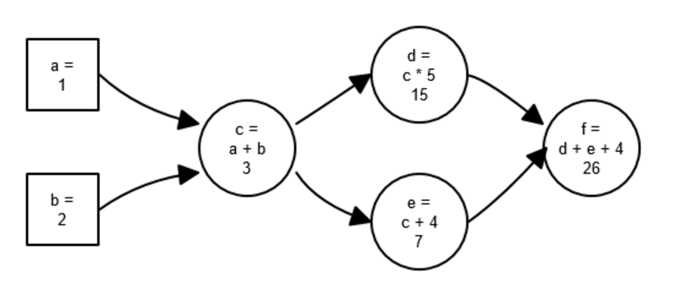
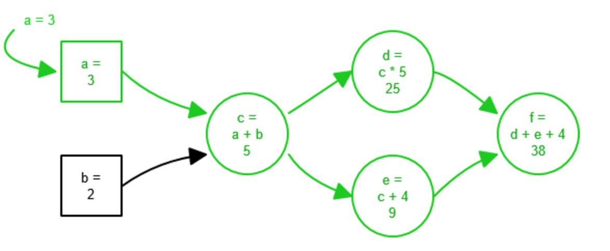
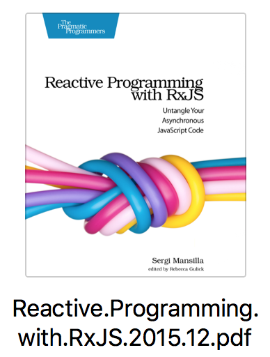
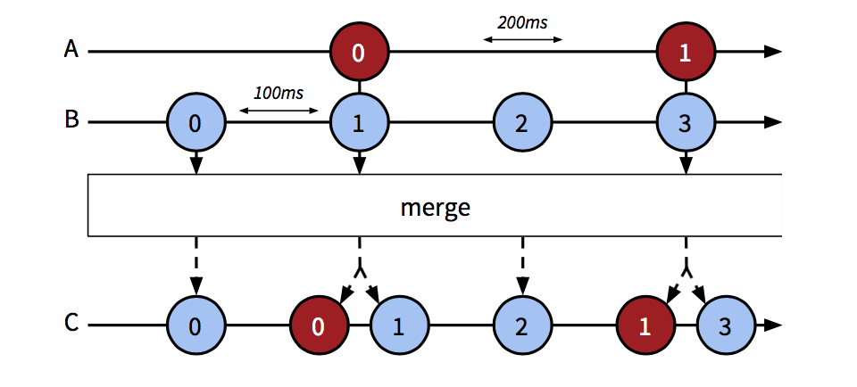
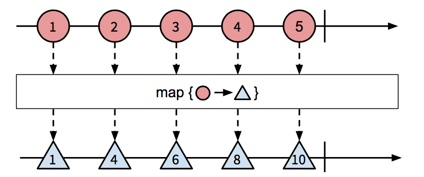
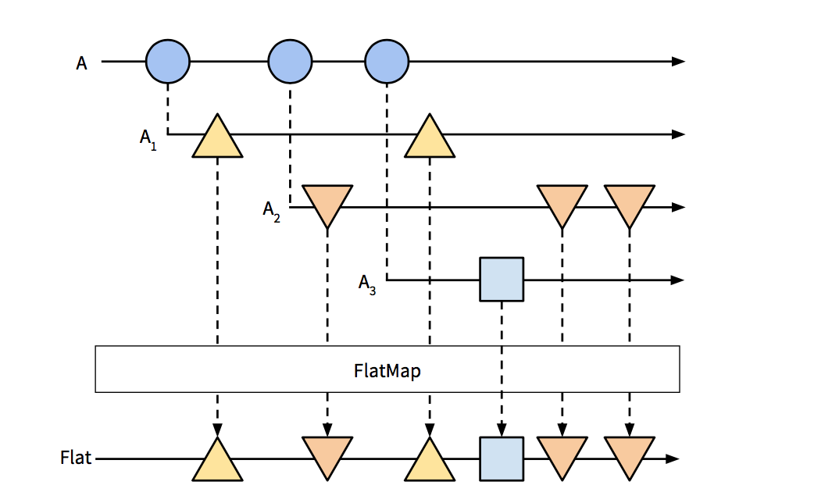
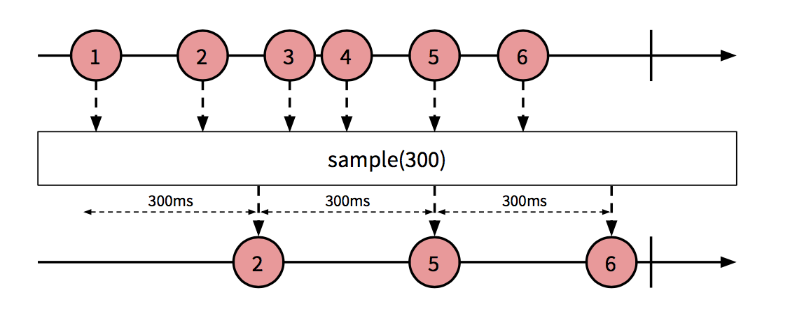

# RxJS

* pure function:
  * stateless
  * no side effect
  * etc..


* what is reactive programming:
  
  
  




# RxJS 优点

  * 适用于开发基于事件的实时程序
  * 降低异步事件比较多的web程序的复杂度


# live demo
  http://jsbin.com/pijivugexa/edit?html,js,console

  ```
    let logv = prefix => v=>console.log(prefix, v)
    let src = Rx.Observable.of(1, 2, 3)
    src.filter(v=>v%2===0).subscribe(logv('from 1th'))

    src.subscribe(logv('from 2th'))
  ```


## RxJS components:

* Observable
  * An Observable doesn’t start streaming items until it has at least one Observer subscribed to it.
  * Like iterators, an Observable can signal when the sequence is completed.

  * creations:
    ```js
    var observable = Rx.Observable.create(
        function(observer) {
          observer.onNext('Simon');
          observer.onNext('Jen');
          observer.onNext('Sergi');
          observer.onCompleted(); // We are done 
        }
      )
    ```

    * Rx.Observable
      ```js
        // from array
        Rx.Observable.from(['Adrià', 'Jen', 'Sergi'])
        // from event
        Rx.Observable.fromEvent(document, 'mousemove')
        // from callback
        var readdir = Rx.Observable.fromNodeCallback(fs.readdir);
        // from interval
        Rx.Observable.interval(200)
        // from promise
        Rx.Observable.fromPromise(p)
      ```

* Observers:
  
  ```js
  var observer = Rx.Observer.create(
    function onNext(x) { console.log('Next: ' + x); }, 
    function onError(err) { console.log('Error: ' + err); }, 
    function onCompleted() { console.log('Completed'); }
  );
  ```


### Operator:
* think in sequnce
  http://reactivex.io/rxjs/class/es6/Observable.js~Observable.html#instance-method-share

  * merge
    ```js
    var a = Rx.Observable.interval(200).map(function(i) {
      return 'A' + i;
    });
    var b = Rx.Observable.interval(100).map(function(i) {
      return 'B' + i;
    });
    Rx.Observable.merge(a, b).subscribe(function(x) {
      console.log(x);
    });
    //B0, A0, B1, B2, A1, B3, B4...
    ```

    

  * map
    ```js
    var src = Rx.Observable.range(1, 5);
    var upper = src.map(function(name) {
      return name * 2;
    });
    upper.subscribe(logValue);
    ```
    
    
  * filter, reduce....

  * flatmap

    `fn flatmap(src: Observable<Observerable<any>>)->Obserable<any>`

    

  * distinct:
    distinct lets us use a function that specifies the comparison method.

    * distinct and distinctUntilChanged
      distinct filters out any result previously emitted and distinctUntilChanged filters out identical results unless a different one is emitted in between. 

      * combine `timestamp` with `distinceUntilChanged`
        
        ```js
        var HeroShots = Rx.Observable.combineLatest(
          playerFiring, // playerFiring Observerable 会有一个timestamp的变量, 通过`timestamp` combinator 加入的, 
          SpaceShip,
          function(shotEvents, spaceShip) {
            return {
              timestamp: shotEvents.timestamp,
              x: spaceShip.x
            };
          })
        .distinctUntilChanged(function(shot) {
          return shot.timestamp; // 这个地方利用 timestamp 变量过滤掉重复的值, 也就是说直到shotEvents发生改变的时候才产生新的值
        }).scan(function(shotArray, shot) {
          shotArray.push({
            x: shot.x,
            y: HERO_Y
          });
          return shotArray;
        }, []);
        ```

  * take(number: int):
    only take first `number` of items

  * reduce:
    ```Rx.Obserable.range(0, 5).reduce((pre, v)=>pre+v, 0).subscribe((sum)=>{...})```

  * scan:
    像reduce, 只不过每次onNext都会执行一次计算, 并onNext出去imediate value, 而不是等 Obserable onComplete
    
    ```js
      var avg = Rx.Observable.interval(1000).scan(function(prev, cur) {
        return {
          sum: prev.sum + cur,
          count: prev.count + 1
        };
      }, {
        sum: 0,
        count: 0
      }).map(function(o) {
        return o.sum / o.count;
      });
      var subscription = avg.subscribe(function(x) {
        console.log(x);
      });
    ```

  * combineLatest:

  * sample:

    
    
    
  * exhaust & exhaustMap:
    http://reactivex.io/rxjs/class/es6/Observable.js~Observable.html#instance-method-exhaustMap

* cancel sequnce, The Disposable
  * Observables themselves don’t have a method to get canceled. Instead, when- ever we subscribe to an Observable we get a Disposable object that represents that particular subscription.

  ```js
  var counter = Rx.Observable.interval(1000);
  var subscription1 = counter.subscribe(function(i) {
    console.log('Subscription 1:', i);
  });
  var subscription2 = counter.subscribe(function(i) {
    console.log('Subscription 2:', i);
  });
  setTimeout(function() {
    console.log('Canceling subscription2!');
    subscription2.dispose();
  }, 2000);
  ```

* handling error
  * onError
    ```js
    getJSON([
      '{"1": 1, "2": 2}',
      '{"success: true}', // Invalid JSON string '{"enabled": true}'
    ]).subscribe(function(json) {
        console.log('Parsed JSON: ', json);
      },
      function(err) {
        console.log(err.message);
      });
    ```

  * catch
    ```js
    function getJSON(arr) {
      return Rx.Observable.from(arr).map(function(str) {
        var parsedJSON = JSON.parse(str);
        return parsedJSON;
      });
    }
    var caught = getJSON(['{"1": 1, "2": 2}', '{"1: 1}']).catch(Rx.Observable.return({
      error: 'There was an error parsing JSON'
    }));
    caught.subscribe(function(json) {
        console.log('Parsed JSON: ', json);
      },
      // Because we catch errors now, `onError` will not be executed
      function(e) {
        console.log('ERROR', e.message);
      });
    ```

  * Retrying Sequences
    ```js
    Rx.DOM.get('/products').retry(5).subscribe(
      function(xhr) {
        console.log(xhr);
      },
      function(err) {
        console.error('ERROR: ', err);
      });
    ```


* hot vs cold obserable: //todo: ? add more txt ?
  * hot: subscribe 那一刻开始接收信号, 以前的信号都会被扔掉
    * Rx.Obserable.fromEvent('mousemove', )
  * cold: subscribe 那一刻开始接受信号, 以前的信号会从头接收:
    * Observables are lazy : means they do not do anything until you subscribe to them.
      * range, ajax request
    * Rx.Obserable.range(1, 5)
    
    * 将 `cold` 转换成 `hot`
      * publish
        * We can turn a cold Observable into a hot one using publish. Calling publish creates a new Observable that acts as a proxy to the original one. It does that by subscribing itself to the original and pushing the values it receives to its subscribers.

        ```js
          // Create an Observable that yields a value every second
          var source = Rx.Observable.interval(1000);
          var publisher = source.publish();
          // Even if we are subscribing, no values are pushed yet.
          var observer1 = publisher.subscribe(function(x) {
            console.log('Observer 1: ' + x);
          });
          // publisher connects and starts publishing values
          publisher.connect();
          setTimeout(function() {
            // 5 seconds later, observer2 subscribes to it and starts receiving // current values, not the whole sequence.
            var observer2 = publisher.subscribe(function(x) {
              console.log('Observer 2: ' + x);
            });
          }, 5000);
        ```
      * share
        >Returns a new Observable that multicasts (shares) the original Observable. As long as there is at least one Subscriber this Observable will be subscribed and emitting data. When all subscribers have unsubscribed it will unsubscribe from the source Observable. Because the Observable is multicasting it makes the stream hot. 

        *


### Subject class:
  * A Subject is a type that implements both Observer and Observable types. As an Observer, it can subscribe to Observables, and as an Observable it can produce values and have Observers subscribe to it.

    ```js
      var subject = new Rx.Subject();
      var source = Rx.Observable.interval(300)
        .map(function(v) {
          return 'Interval message #' + v;
        }).take(5);
      source.subscribe(subject); // subject is an Observer
      var subscription = subject.subscribe( // subject is an Obserable
        function onNext(x) {
          console.log('onNext: ' + x);
        },
        function onError(e) {
          console.log('onError: ' + e.message);
        },
        function onCompleted() {
          console.log('onCompleted');
        }
      );
      subject.onNext('Our message #1');
      subject.onNext('Our message #2');
      setTimeout(function() {
        subject.onCompleted();
      }, 1000);
      /*
      onNext: Our message #1 
      onNext: Our message #2 
      onNext: Interval message #0 
      onNext: Interval message #1 o
      nNext: Interval message #2 
      onCompleted
      */
    ```
  * AsyncSubject:
    * AsyncSubject emits the last value of a sequence only if the sequence completes. (只让sequence返回最后的值, 只当请求成功的时候)
    * 可以用做cache, cache 最后一次成功的数据
  * BehaviorSubject
    * 跟 AsyncSubject 一样, 只不过允许有一个默认的值, placeholder value. 

    ```js
      var subject = new Rx.BehaviorSubject('Waiting for content');
      subject.subscribe(function(result) {
          document.body.textContent = result.response || result;
        },
        function(err) {
          document.body.textContent = 'There was an error retrieving content';
        });
      Rx.DOM.get('/remote/content').subscribe(subject);
    ```
  * ReplaySubject:
    * A ReplaySubject caches its values and re-emits them to any Observer that sub- scribes late to it. Unlike with AsyncSubject, the sequence doesn’t need to be completed for this to happen.


### Scheduler:(调度器):
  * it's like a clock, virtual timers. controll how onNext when onNext triggers. (in a block manner or async manner).
  * performance tweaking

  * Immediate Scheduler:(block)

    ```js
    Rx.Observable.range(1, 5).do(function(a) {
      console.log('Processing value', a);
    })
    .map(function(value) {
      return value * value;
    }).subscribe(function(value) {
      console.log('Emitted', value);
    });
    console.log('After subscription');
    /*
    Before subscription 
    Processing value 1 Emitted 1 
    Processing value 2 Emitted 4 
    Processing value 3 Emitted 9 
    Processing value 4 Emitted 16 
    Processing value 5 Emitted 25
    After subscription
    */
    ```

  * Default Scheduler: (aysnc)

    ```js
    console.log('Before subscription');
    Rx.Observable.range(1, 5)
      .do(function(value) {
        console.log('Processing value', value);
      })
      .observeOn(Rx.Scheduler.default)
      .map(function(value) {
        return value * value;
      }).subscribe(function(value) {
        console.log('Emitted', value);
      });
    console.log('After subscription');
    
    /*
    Before subscription 
    Processing value 1 
    Processing value 2 
    Processing value 3 
    Processing value 4 
    Processing value 5 After subscription Emitted 1
    Emitted 4
    Emitted 9
    Emitted 16
    Emitted 25
    */
    ```

  * Current Thread Scheduler: (block, but ?)
    * A recursive operator: is an operator that itself schedules another operator. eg. `repeat`

  * Rx.Scheduler.requestAnimationFrame: (for animation, block)

  * Rx.TestScheduler: (for test)


# Links
* [rx-book](https://xgrommx.github.io/rx-book/why_rx.html)
* [Rxjs create infinite scroll](https://medium.com/@Sureshkumar_Ash/naive-infinite-scroll-in-reactive-programming-using-rxjs-observables-4a605d3146e8#.xnvb37wy9)
* [youtube rxjs tutorial](https://www.youtube.com/watch?v=T9wOu11uU6U&list=PL55RiY5tL51pHpagYcrN9ubNLVXF8rGVi)