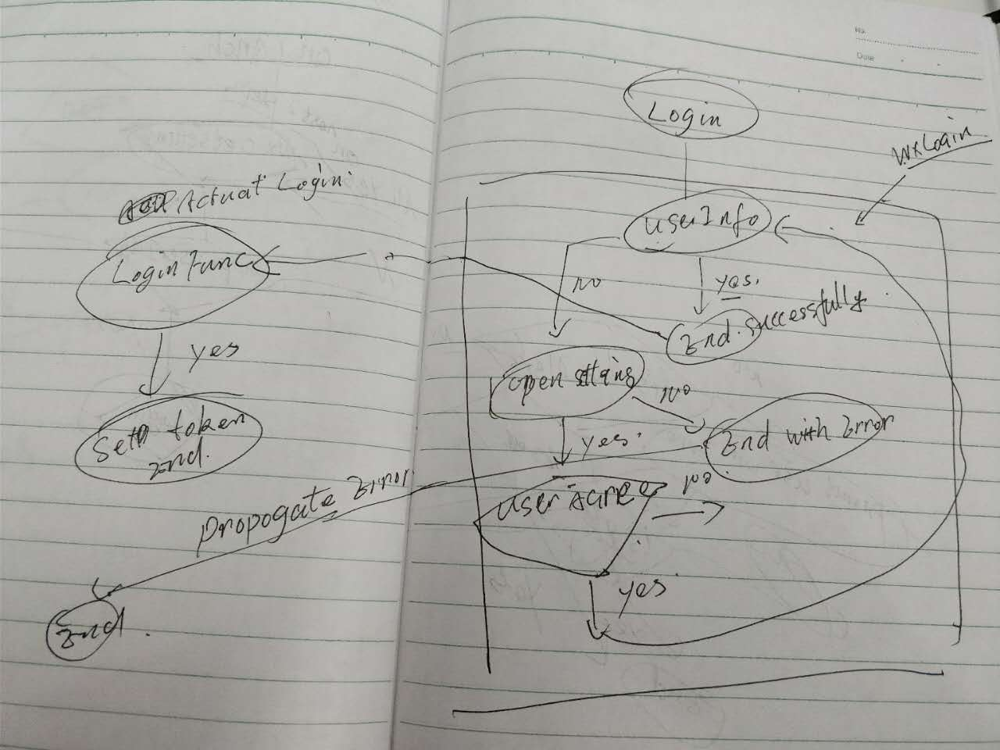

# 微信小程序分享

微信小程序的痛点

* js
  * npm 包安装的方式不支持
  * 没有简单的方式支持全局的变量
    * babel
  * 某些情况 js 支持并不好, 有些语法会导致诡异的问题
    * deepClone 用了 for (let [key, value] of Object.entries(obj)) 这样的方式, 微信小程序提示 pages/home/home not found. 提示的错误信息丝毫不利于我们排查错误
    * getter 不支持, 导致 mobx 的 computed annotation 不能使用
  


css:
  * 每个页面的css都是隔离的，避免了全局的css污染的问题也导致了某些情况下css比较难以重用
    * 可以用app.css来设置全局的css
  * 没法引用变量
  * 支持的选择器有限，
    ```css
    view>text text {} /* ok */
    view>text > text {} /* not ok */
    ```


template:
  * 模板用法比较诡异，由于底层的技术的问题，底层的数据只能传递简单的数据对象，不能带任何复杂的格式，这包括没法调用 controller 层的方法
    * 不能传递循环引用的数据, 
  * 模板的组件化支持也不是很好用


未来的优化点:


我们做的三个工程:
* eslint-config-wx-mini-program
* babel-plugin-import-replace
* main


## babel
这个工程我们用了 babel， 而没有用到 typescript 的 compiler， 因为 ts compiler 本身对hack并不友好


### babel-plugin-import-replace
* [babel markdown plugin](https://github.com/egoist/babel-plugin-markdown)
  
  ```js
  const html = markdown`
  # hello

  **This is markdown**
  `

  // yield:

  const html = "<h1>hello</h1><p><strong>This is markdown</strong></p>"
  ```

* 受到这项目的启发, 我们完全可以通过遍历 js ast来动态修改 import 中的内容, 将全局的import动态替换成我们需要的格式


核心的代码逻辑.

compiler 的工作方式,  tokenize, parsing, transformat ast tree, output code.

```js
// t 提供了一系列便捷的方法判断 ast node各个节点的类型
export default function ({ types: t }) {
  return {
    pre(state) {
      // 这里拿不到compiler plugin的数据
    },
    visitor: {
      // state 中存储了 plugin 的options
      ImportDeclaration(path, state) {

      },
    }
  };
}

```

在 main 工程中的babel.rc文件中引用


```js
    "production": {
      "plugins": [
        "transform-decorators-legacy", // should always be the first plugin!
        "transform-async-to-generator",
        ["import-replace", {"configFile": "temp/import-config.json"}]
      ]
    }
```


#### links:
* [babel playbook](https://github.com/thejameskyle/babel-handbook/blob/master/translations/en/plugin-handbook.md)
* compiler
  * [ReactNL 2016 James Kyle - How to Build a Compiler](https://www.youtube.com/watch?v=ZYFOWesCm_0)
  * [how to be a compiler](https://medium.com/@kosamari/how-to-be-a-compiler-make-a-compiler-with-javascript-4a8a13d473b4)


### babel async await 支持

由于授权逻辑很复杂，promise 大量应用, 导致代码在可读性上变差，所以决定引入 async await 的支持

* babel 支持async await的配置:

  ```js
  .babelrc
    {
      "presets": [
        "es2015",
        "stage-2"
      ],
      plugins:[
        "transform-async-to-generator"
        ["transform-runtime", { "polyfill": false, "regenerator": true }] // https://stackoverflow.com/questions/33527653/babel-6-regeneratorruntime-is-not-defined
      ]
    }
  ```


其中 transform-async-to-generator 内部包括了 [Regenerator transform plugin](https://babeljs.io/docs/plugins/transform-regenerator/)
这个插件会将 async await 的组合调用换成以regenerator runtime封装的调用

转换后的code 类似于:

```js
  var _marked = [a].map(regeneratorRuntime.mark);

  function a() {
    return regeneratorRuntime.wrap(function a$(_context) {
      while (1) {
        switch (_context.prev = _context.next) {
          case 0:
            _context.next = 2;
            return 1;

          case 2:
          case "end":
            return _context.stop();
        }
      }
    }, _marked[0], this);
  } 
```

其中 `regeneratorRuntime` 就是 `generator` 运行时的全局变量, 可以看到如果没有这个变量, 程序就会在运行的时候报错。

解决方式呢就是引用, babel-plugin-transform-runtime 加上 babel-runtime. 我来说下这两个插件的作用

* `babel-runtime`, 一系列 babel 用的兼容和工具库, 因为默认的方式是 babel 编译的时候会把一些工具库直接插入在对应的的文件中。
  如果文件多了的话，一定会插入很多相同的代码。 这样 babel-runtime 这个库就被抽象出来作为公用的库。
* `babel-plugin-transform-runtime`, 这个插件的作用就是会把原本插入到编译后文件中的辅助代码转换成 `require('babel-runtime/xx')`
  这种调用, 这样就减少了各个分散的荣誉代码

但是可以看到这种方式并不适合与小程序编程, 因为小城并不支持babel-runtime这种方式。所以这种方式解决 async await 调用就行不通。


但是我们观察[babel-plugin-transform-runtime](https://babeljs.io/docs/plugins/transform-runtime/#regenerator-aliasing)生成
的代码


```js

"use strict";

var _regenerator = require("babel-runtime/regenerator");

var _regenerator2 = _interopRequireDefault(_regenerator);

function _interopRequireDefault(obj) { return obj && obj.__esModule ? obj : { default: obj }; }

var _marked = [foo].map(_regenerator2.default.mark);

function foo() {
  return _regenerator2.default.wrap(function foo$(_context) {
    while (1) {
      switch (_context.prev = _context.next) {
        case 0:
        case "end":
          return _context.stop();
      }
    }
  }, _marked[0], this);
}

```


可以看到它依赖了 babel-runtime/regenerator 这个库, 进入 node_modules 下找这个库, 发现它只是简单 require('regenerator-runtime')
。所以，关键的就是我们需要把  regenerator-runtime 这个库关联到上边说的 regeneratorRuntime 变量当中。


我们只需要这么做, disable掉了eslint 是因为这个变量我们代码中并不会用到，只是编译后的文件需要用到:

```js
  // npm install -S regenerator-runtime
  /* eslint-disable */
  import regeneratorRuntime from 'regenerator-runtime'
  /* eslint-enable */
```


文中省略了用 generator 方式去实现 async await 的机制，有兴趣的自己查阅文档。
类似的有 cojs, ts 将async await编译后的代码


```js

getUserInfo(callback) {
    Promisify(wx.getSetting)
      .then(res => {
        if (res.authSetting['scope.userInfo']) {
           Promisify(wx.getUserInfo)
            .then((res => {
              wx.setStorageSync('userInfo', res.userInfo);
              callback && callback().catch((err) => {
                wx.hideLoading(); 
                Promisify(wx.showModal, {
                  title: '提示',
                  showCancel: false,
                  content: err || '请求失败，请稍后再试'
                })
              })  
            }))
        }else {
          Promisify(wx.authorize, { scope: 'scope.userInfo' })
            .then(() => this.getUserInfo(callback))
            .catch(() => {
              Promisify(wx.showModal, {
                title: '提示',
                content: '请先设置允许我们获得您的公开信息',
                confirmText: '去设置',
              }).then(res => {
                if (res.confirm) {
                  Promisify(wx.openSetting)
                    .then(res => {
                      res.authSetting = {
                        "scope.userInfo": true
                      }
                      this.getUserInfo(callback)
                    })
                }
              })
            })
        }
      })
  },

```


之后

```js

 async getUserInfo(callback) {
    let res = await Promisify(wx.getSetting)
    if (res.authSetting['scope.userInfo']) {
      res = await Promisify(wx.getUserInfo)
      wx.setStorageSync('userInfo', res.userInfo);
      callback && callback().catch((err) => {
        wx.hideLoading();
        return Promisify(wx.showModal, {
          title: '提示',
          showCancel: false,
          content: err || '请求失败，请稍后再试'
        })
      })
    } else {
      try {
        await Promisify(wx.authorize, { scope: 'scope.userInfo' })
        await this.getUserInfo(callback)
      } catch (_) {
        res = await Promisify(wx.showModal, {
          title: '提示',
          content: '请先设置允许我们获得您的公开信息',
          confirmText: '去设置',
        }).catch(e => console.error(e))
        if (res) {
          res.authSetting = {
            "scope.userInfo": true
          }
          this.getUserInfo(callback)
        }
      }
    }
  },
```


#### links:
* https://stackoverflow.com/questions/33527653/babel-6-regeneratorruntime-is-not-defined


## webpack
虽然我们能够替换了引入的global的包到相对路径, 我们还需要webpack帮助我们把实际依赖的包打到对应的路径下。

```js
const utils = require('./build-scripts/utils-es5') 

let deps = utils.getDependencies() // 动态读取package.json中的文件
let libsPath = utils.getConfig().libsPath

module.exports = {
  entry: genernateEntry(deps),
  output: {
    path: libsPath,
    filename: "[name].js",
    libraryTarget: "commonjs2", // 格式，这个地方需要注意下
  }
};


function genernateEntry(entries){
  let r = {}
  entries.forEach(e=>r[e]=`./node_modules/${e}`) 
  return r
}
```


## mobx
为了共享数据，我们需要一个管理store的库
js 的 store 选用了mobx, 因为使用起来要比 redux 简单, 我们封装了 mobx-wx 的库, 


* 以 this.app 来 access 全局的 app 对象
* 

```js

let mapstore = store => {
  return { status: store.orderDetailStore.status, cart: store.cartStore }
}

let mapaction = store => {
  let cs = store.cartStore

  return {
    increaseItem(evt) {
      let dataset = evt.target.dataset
      cs.increase(dataset.idx)
      ctx.forceUpdate()
    },
    subtractItem(evt) {
      let dataset = evt.target.dataset
      cs.substract(dataset.idx)
      ctx.forceUpdate()
    },
    // 购物车组件
    cartDoClear() {
      cs.clear()
    }
  }
}

let mapreactions = store => {
  let cs = store.cartStore

  return [[
    () => cs.items.length,
    function (length) {
      if (length === 0) {
        ctx.toggleFold(true)
      }
    }
  ]]
}
mobxWX(mapstore, mapaction, mapreactions)(config)
```


## 其他工程化的努力

* 用rxjs和node的fs.watch方法实现了文件监听,并trigger动态的copy, 优化dev的体验


## 遇到的痛点，坑

* 授权, 项目中最复杂的一个点
  * App 第一次启动
    
  * 登录
    
  * 拦截网络请求
    
  

* 异步导致的竞争问题
* 报错的方式很诡异
* 报错之后的 navigator 没法点击
  * 这个是navigateTo调用多次导致的，似乎

* mobx 
  * store不能直接修改, 只能通过 @action 标注过的方法更改
  * 

* babel-core 提供的api不能正确加载传入的options配置
  * 替换用 babel-cli 的watch mode

## 未来我们工程可以优化的点

* 通过 babel 编译引入全局变量的支持
* 差异化构建，根据不同 environment 打包不同的项目结构
* 加入 postcss 到编译流程中，解决 css 变量的问题
  * @import z
* 引入 webpack， 但是 webpack 如何做多个文件的输出, 而不是打包


